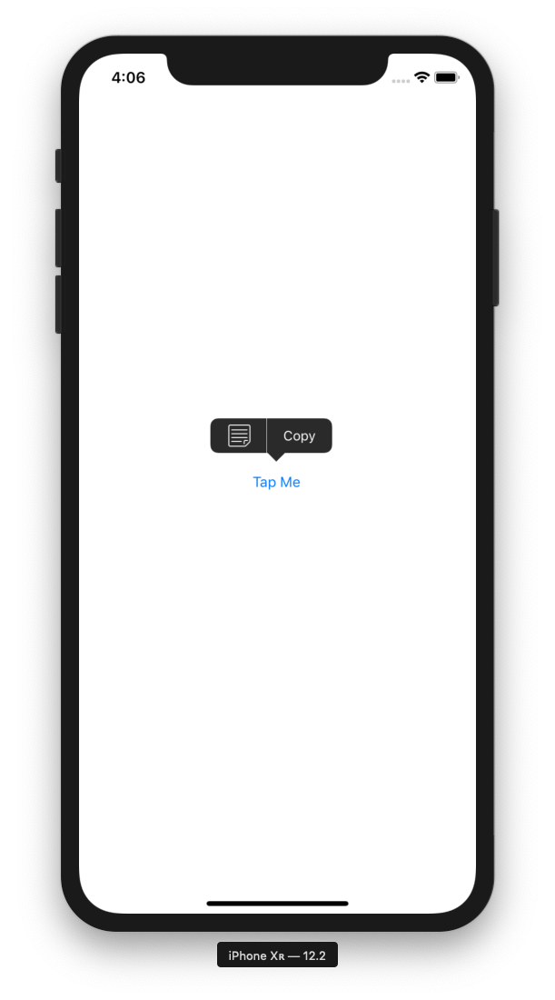

# SPMenuKit

[](https://travis-ci.org/shiqp/SPMenuKit)
[](https://cocoapods.org/pods/SPMenuKit)
[](https://cocoapods.org/pods/SPMenuKit)
[](https://cocoapods.org/pods/SPMenuKit)

## Summary

`SPMenuKit` supports to present images for `UIMenuController`. The main class `SPMenuItem` inherits from `UIMenuItem`.



## Example

To run the example project, clone the repo, and run `pod install` from the Example directory first.

## Installation

SPMenuKit is available through [CocoaPods](https://cocoapods.org). To install
it, simply add the following line to your Podfile:

```ruby
pod 'SPMenuKit'
```

## Usage

1. Import: `import SPMenuKit`
2. Install: `SPMenuItem.install()`
3. Init menu item: `let _ = SPMenuItem(title: "Title", image: UIImage(named: "image")!, action: #selector(onMenuItemTapped))`

## Author

shiqp, qingpu.shi@gmail.com

## License

SPMenuKit is available under the MIT license. See the LICENSE file for more info.
